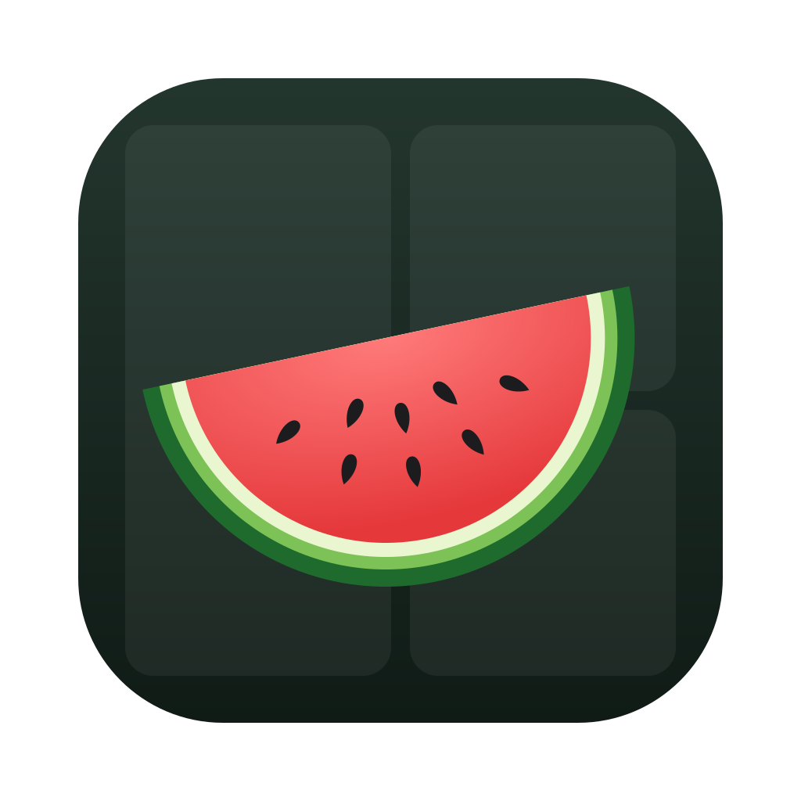

<p align="center">
  
</p>

# Komorebi Menubar

[](https://github.com/zepocas/komorebi-menubar/actions/workflows/ci.yml)

A small native menubar item for [komorebi for Mac](https://komorebi-for-mac.lgug2z.com), inspired
by AeroSpace's built-in workspace indicator.

- Shows the focused workspace of **every monitor**, e.g. `2 │ 5`. The focused monitor is in bold.
  It updates instantly because komorebi pushes events to it.
- Its menu can **switch komorebi config profiles** and **restart komorebi and skhd**.
- Optional LaunchAgents start **komorebi, skhd and the menubar app at login**.

It's plain Swift and AppKit with no dependencies. It uses almost no CPU while idle and needs no
permissions of its own.

## Requirements

- macOS 14 or later on Apple silicon (developed on macOS 27).
- [komorebi for Mac](https://komorebi-for-mac.lgug2z.com) with `komorebi` and `komorebic` on your
  machine, looked up in `~/.local/bin`, `/opt/homebrew/bin` and `/usr/local/bin`.
- Swift 6 toolchain: either Xcode or just the Command Line Tools (`xcode-select --install`).
- Optional: [skhd](https://github.com/koekeishiya/skhd) (`brew install koekeishiya/formulae/skhd`).

## Setup

### 1. Install the app

**With Homebrew:**

```sh
brew install --cask zepocas/tap/komorebi-menubar
```

**Or from source:**

```sh
git clone git@github.com:zepocas/komorebi-menubar.git
cd komorebi-menubar
make test      # optional: run the unit tests
make run       # builds KomorebiMenubar.app, installs it to /Applications and opens it
```

The workspace number should now appear in the menubar. The app must live in `/Applications`, which
both methods do. On macOS 27, menubar managers like Thaw can drop items from apps in
`~/Applications` (see [Troubleshooting](#troubleshooting)).

### 2. Start at login

In the app's menu, open **Start at Login** and tick what you want started at login. Each one is
separate:

| Item | LaunchAgent | Runs | When on |
|---|---|---|---|
| **Komorebi Menubar** | `io.github.zepocas.komorebi-menubar` | the app | restarts after a crash; stays quit after *Quit* |
| **komorebi** | `io.github.zepocas.komorebi` | `komorebi --config <config dir>/active.json` | restarts after a crash; stays stopped after `komorebic stop` |
| **skhd** | `io.github.zepocas.skhd` | `skhd -c <skhdrc>` | always kept running |

Changes take effect at your next login. **Start komorebi** / **Start skhd** in the menu work either
way: they install the agent if needed (not starting at login) and start the daemon through launchd.
The first time, that also stops a komorebi or skhd you started by hand, so two don't run.

### 3. Grant permissions

komorebi and skhd now run as their own processes instead of under your terminal. So macOS checks
*their* permissions, not your terminal's. In **System Settings → Privacy & Security**, allow:

- **Accessibility:** `komorebi` (e.g. `~/.local/bin/komorebi`) and `skhd` (e.g. `/opt/homebrew/bin/skhd`)
- **Screen Recording:** `komorebi`

Then use **Start**/**Restart komorebi** and **skhd** from the Komorebi Menubar menu. If you upgrade skhd with
Homebrew, its real path changes and you may need to grant it again.

### 4. Menubar managers (Thaw, Ice, Bartender)

New items can land in the hidden section. Drag **Komorebi Menubar** into the visible section,
using the manager's layout settings or ⌘-drag in the menubar.

## Usage

**The label**
- One segment per monitor, in komorebi's monitor order.
- Each segment is the workspace `name` from your config, or its number if it has no name.
- A dimmed icon means komorebi isn't running. It reconnects on its own when komorebi comes back.
- macOS shows the same item on every display's menubar, so the label always lists all monitors.

**The menu**

| Item | What it does |
|---|---|
| komorebi / skhd status | Whether each is running, with its PID |
| **Profile ▸** | Switches the komorebi config (see below) |
| **Restart komorebi** | `komorebic stop` (restores hidden windows), then starts it through its launchd agent. Shows **Start komorebi** when it isn't running |
| **Restart skhd** | Restarts the skhd agent |
| **Open Config Folder** | Opens your komorebi config directory |

### Profiles

A profile is any `komorebi*.json` in your komorebi config directory (`$KOMOREBI_CONFIG_HOME`, or
`~/.config/komorebi` by default). `komorebi.bar*.json` files are ignored. The menu names them like this:

| File | Shown as |
|---|---|
| `komorebi.json` | default |
| `komorebi.work.json` | work |
| `komorebi.laptop.json` | laptop |

The chosen profile is stored as a symlink, `active.json → komorebi.<profile>.json`. The app creates
it on first launch, pointing at `komorebi.json`. The komorebi agent always starts `active.json`, so
your choice survives restarts and reboots. When you pick a profile, the app moves the link and
restarts komorebi.

## Configuration

- **Config directory:** `$KOMOREBI_CONFIG_HOME` if set, otherwise `~/.config/komorebi`.
- **skhd config:** `<config dir>/skhdrc` if it exists, otherwise `~/.config/skhd/skhdrc`.
- **Binaries:** `komorebi`, `komorebic` and `skhd` are looked up in `~/.local/bin`,
  `/opt/homebrew/bin`, `/usr/local/bin` and your `PATH`.
- **Agent names:** `io.github.zepocas.*`, in `Sources/KomorebiMenubar/LaunchAgents.swift`.
- The agents get these paths written into them. After changing one, toggle **Start at Login** for
  that item off and on again to rewrite its agent.

## Troubleshooting

**The icon doesn't show, but the app is running.**
Check that it's installed in `/Applications`, not `~/Applications`. Then quit and reopen your
menubar manager. On macOS 27, Thaw can remove other apps' items
([thaw-app/Thaw#1135](https://github.com/thaw-app/Thaw/issues/1135)). Quitting Thaw briefly tells
you whether it's the cause.

**"skhd is also started by the com.koekeishiya.skhd LaunchAgent".**
skhd was installed as a service by another tool too, so it would run twice. Remove that one
(`skhd --uninstall-service` or `brew services stop skhd`) and try again.

**komorebi doesn't come back after a restart.**
Check `~/Library/Logs/komorebi.log`. The message `failed to request screen capability` means
komorebi is missing Screen Recording or Accessibility (see step 3).

**skhd exits right after starting.**
It's missing Accessibility access. Check `~/Library/Logs/skhd.log`.

**Checking the agents.**
```sh
launchctl print gui/$(id -u)/io.github.zepocas.komorebi | grep -E 'state|pid|last exit'
```

## Uninstall

```sh
make uninstall        # removes /Applications/KomorebiMenubar.app
brew uninstall --cask --zap komorebi-menubar    # if you installed with Homebrew (--zap also removes its agents)
```

Untick everything under **Start at Login** first if you built from source, or remove the
`io.github.zepocas.*` plists from `~/Library/LaunchAgents`. Then start komorebi and skhd by hand again
(`komorebic start`, `skhd -c …`). You can delete `<config dir>/active.json` if you don't need it.

## How it works

- **Live updates:** the app listens on `komorebi-menubar.sock` in
  `~/Library/Application Support/komorebi/` and runs `komorebic subscribe-socket` once. komorebi
  then opens one connection per event and writes a single `{event, state}` JSON document. The app
  redraws only when the label text changes, because komorebi sends a steady stream of window
  move and resize events.
- **Reconnecting:** every 2 s the app checks for the `komorebi` process, which is cheap. A new PID
  means a fresh komorebi that has forgotten the subscription, so the app subscribes again and
  loads `komorebic state` straight away.
- **Start at Login** only rewrites the agent plists, and they take effect at the next login. It never
  unloads a running job: the app's own agent may be running the app itself. When off, komorebi's and
  skhd's plists stay installed with neither `RunAtLoad` nor `KeepAlive`, because any `KeepAlive`
  implies `RunAtLoad`. That way the menu can still start them through launchd. It's a plain plist, not
  `SMAppService`: the app is ad-hoc signed, and `SMAppService` pins the registration to the exact
  build, so the agent would stop launching after any update.
- **One copy:** the newest copy of the app asks older ones to quit, which covers `brew upgrade`
  reopening the app while its login agent restarts it too.
- **Why starts go through launchd:** if the app launched komorebi or skhd itself, macOS would
  treat the app as their "responsible process" and check *the app's* Accessibility and Screen
  Recording permissions. Run by launchd, they use their own permissions, so the menubar app needs none.

### komorebi-for-mac quirks this works around

- `komorebic replace-configuration` crashes komorebi (`macos_api.rs:204`) and leaves it ignoring
  commands. That's why switching profile restarts komorebi, and why restart falls back to SIGTERM.
- `komorebic start --config <path>` passes a broken flag to komorebi, so the agent runs `komorebi`
  directly.
- `komorebic reload-configuration` doesn't exist. Use the menu's restart instead.

## Development

```
Sources/MenubarCore/        decoding, label formatting, profile discovery, agent plists (unit tested)
Sources/KomorebiMenubar/    AppKit app: socket subscriber, process watcher, menu, launchd agents
Tests/MenubarCoreTests/     Swift Testing suite and a JSON fixture
Resources/                    Info.plist, AppIcon.svg (icon source) and the generated AppIcon.icns
packaging/                    Homebrew cask template
scripts/                      bundle.sh (builds the .app), make-icon.sh, bump-cask.sh
```

| Command | Does |
|---|---|
| `make build` | debug build |
| `make test` | unit tests |
| `make install` | release build, installed to `/Applications` |
| `make run` | install and open |
| `make uninstall` | remove the app |
| `make icon` | regenerate `AppIcon.icns` from `AppIcon.svg` |
| `make clean` | delete build output |

When the agents are loaded, `make install` is enough to update: launchd relaunches the new build.

## Releasing

1. Tag and push: `git tag v0.2.0 && git push origin v0.2.0`. The **Release** workflow tests,
   builds (version stamped from the tag), and attaches `KomorebiMenubar-0.2.0.zip` to the GitHub
   Release, creating the release if it doesn't exist. To rebuild an existing tag:
   `gh workflow run release.yml -f tag=v0.2.0`.
2. Update the cask: `scripts/bump-cask.sh 0.2.0`. It downloads the zip, writes
   `Casks/komorebi-menubar.rb` (from `packaging/komorebi-menubar.rb.in`) into a clone of
   [zepocas/homebrew-tap](https://github.com/zepocas/homebrew-tap) at `~/code/homebrew-tap`
   (override with `TAP_DIR`), and commits it.
3. Push the tap: `git -C ~/code/homebrew-tap push`.

## License

[MIT](LICENSE)
